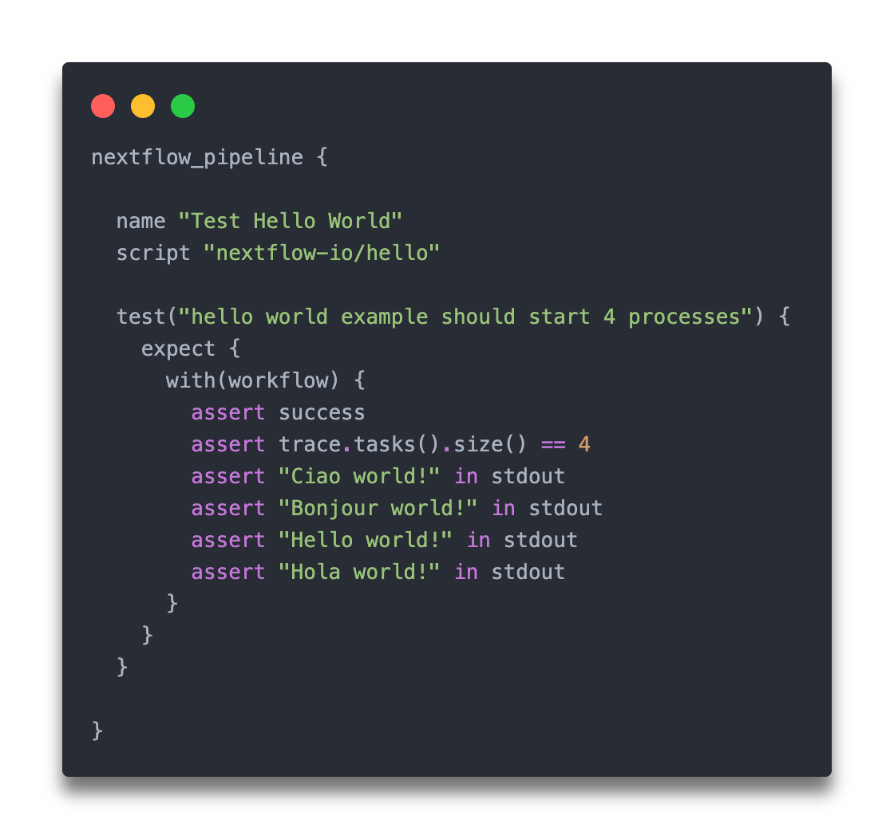

---
hide:
  - navigation
  - toc 
---

{ .right .image}

# nf-test: A simple testing framework<br> for Nextflow pipelines


Test your production ready [Nextflow pipelines](https://nextflow.io) in an efficient and automated way. 🚀


[:fontawesome-solid-book: Getting Started](docs/getting-started.md){ .md-button .md-button--primary} [:fontawesome-solid-download: Installation](installation.md){ .md-button } [:fontawesome-brands-github: Source](https://github.com/askimed/nf-test){ .md-button }

---

[:material-check-circle:]() A DSL language **similar to Nextflow**  <br/>
[:material-check-circle:]() Describes expected behavior using 'when' and 'then' blocks <br/>
[:material-check-circle:]() Abundance of functions for writing **elegant and readable assertions** <br/>
[:material-check-circle:]() Utilizes **snapshots** to write tests for complex data structures <br/>
[:material-check-circle:]() Provides commands for **generating boilerplate** code <br/>
[:material-check-circle:]() Includes a **test-runner** that executes these scripts <br/>
[:material-check-circle:]() Easy installation on **CI systems** <br/>

---

## :material-check-all: Unit testing

nf-test enables you to test all components of your data science pipeline: from end-to-end testing of the entire pipeline to specific tests of processes or even custom functions. This ensures that all testing is conducted consistently across your project.

=== ":fontawesome-solid-diagram-project: Pipeline"

    ```Groovy
    nextflow_pipeline {

      name "Test Hello World"
      script "nextflow-io/hello"

      test("hello world example should start 4 processes") {
        expect {
          with(workflow) {
            assert success
            assert trace.tasks().size() == 4
            assert "Ciao world!" in stdout
            assert "Bonjour world!" in stdout
            assert "Hello world!" in stdout
            assert "Hola world!" in stdout
          }
        }
      }

    }
    ```

=== ":material-square-circle: Process"

    ```Groovy
    nextflow_process {

        name "Test Process SALMON_INDEX"
        script "modules/local/salmon_index.nf"
        process "SALMON_INDEX"

        test("Should create channel index files") {

            when {
                process {
                    """
                    input[0] = file("test_data/transcriptome.fa")
                    """
                }
            }

            then {
                //check if test case succeeded
                assert process.success
                //analyze trace file
                assert process.trace.tasks().size() == 1
                with(process.out) {
                    // check if emitted output has been created
                    assert index.size() == 1
                    // count amount of created files
                    assert path(index.get(0)).list().size() == 16
                    // parse info.json file
                    def info = path(index.get(0)+'/info.json').json
                    assert info.num_kmers == 375730
                    assert info.seq_length == 443050
                    //verify md5 checksum
                    assert path(index.get(0)+'/info.json').md5 == "80831602e2ac825e3e63ba9df5d23505"
                }
            }

        }

    }
    ```

=== ":material-square-root: Functions"
    ```Groovy
    nextflow_function {

        name "Test functions"
        script "functions.nf"

        test("Test function1") {
          function "function1"
          ...
        }

        test("Test function2") {
          function "function2"
          ...
        }
    }
    ```

:material-arrow-right: Learn more about [pipeline tests](docs/testcases/nextflow_pipeline.md), [workflow tests](docs/testcases/nextflow_workflow.md), [process tests](docs/testcases/nextflow_process.md) and [function tests](docs/testcases/nextflow_function.md) in the documentation.

---

## :material-content-save-check: Snapshot testing

nf-test supports **snapshot testing** and automatically **generates a baseline set of unit tests** to safeguard against regressions caused by changes.</br>nf-test captures a snapshot of output channels or any other objects and subsequently compares them to reference snapshot files stored alongside the tests. If the two snapshots do not match, the test will fail

:material-arrow-right: [Learn more](docs/assertions/snapshots.md)

---

## :material-power-plug-outline: Highly extendable

nf-test supports the **inclusion of third-party libraries** (e.g., jar files) or functions from Groovy files. This can be done to either extend its functionality or to prevent code duplication, thus maintaining simplicity in the logic of test cases. Given that many assertions are specific to use cases, nf-test incorporates a **plugin system** that allows for the extension of existing classes with custom methods. For example [FASTA file support](docs/assertions/fasta.md).

:material-arrow-right: [Learn more](docs/assertions/libraries.md)

---

## :material-star: Support us

We love stars as much as we love rockets! So make sure you [star us on GitHub](https://github.com/askimed/nf-test).

<!-- Place this tag where you want the button to render. -->
<a class="github-button" href="https://github.com/askimed/nf-test" data-icon="octicon-star" data-size="large" data-show-count="true" aria-label="Star askimed/nf-test on GitHub">Star</a>

Show the world your Nextflow pipeline is using nf-test and add the following badge to your `README.md`:

[](https://code.askimed.com/nf-test)

```
[](https://code.askimed.com/nf-test)
```

----

## :material-account-supervisor: About

nf-test has been created by [Lukas Forer](https://twitter.com/lukfor) and [Sebastian Schönherr](https://twitter.com/seppinho) and is MIT Licensed.


[](https://github.com/lukfor)
[](https://github.com/seppinho)

Thanks to all the [contributors](about.md) to help us maintaining and improving nf-test!

---
